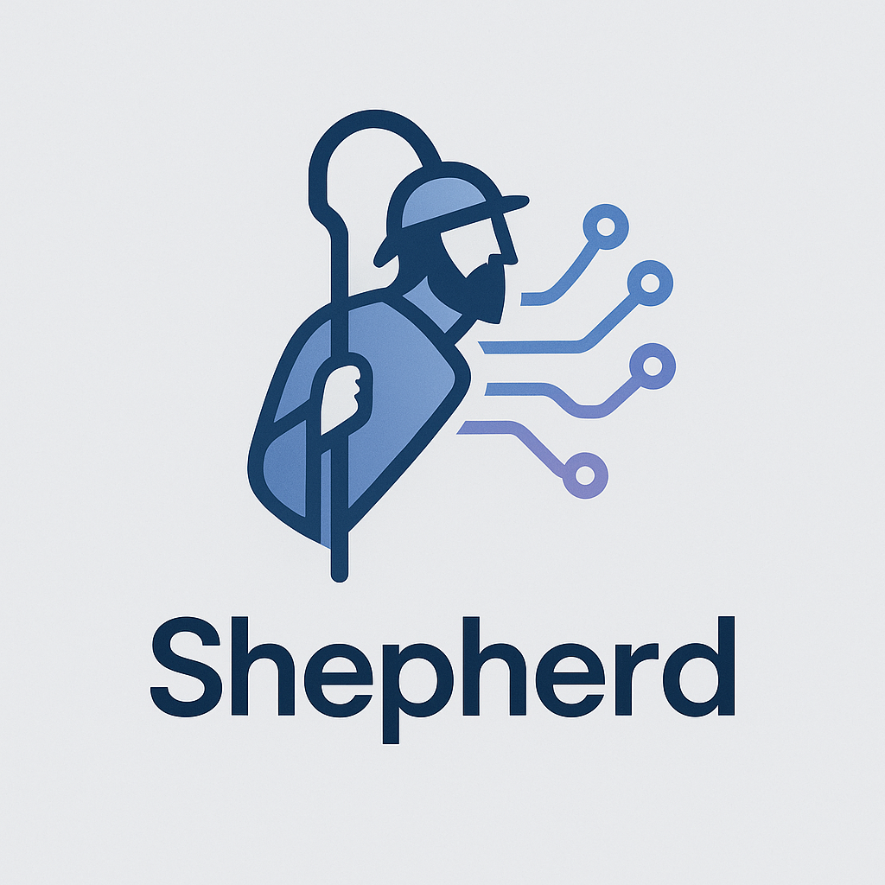

## SEPHERD

SEPHERD is a lightweight C++ proxy designed to interface with the Ollama Large Language Model (LLM) server. Tailored for embedded systems like the Raspberry Pi, SEPHERD facilitates efficient api fetching with LLMs, making it ideal for mobile applications and resource-constrained environments.

## 🧱 Planned Features

    Authentication: Implements API key-based authentication to secure access to the Ollama server.

    Logging: Provides detailed logging of requests and responses for monitoring and debugging purposes.

    Prompt Handling: Efficiently processes and forwards prompts to the Ollama server, ensuring seamless communication.
    GitHub

## 🛠️ Built With

    C++11: Utilizes modern C++ features for robust and efficient performance.

    RapidJSON: A fast JSON parser and generator for C++.

    libcurl: A client-side URL transfer library supporting various protocols.

## 🚀 Getting Started

Prerequisites

Ensure the following dependencies are installed on your system:

    libcurl: For HTTP requests.

    RapidJSON: For JSON parsing and serialization.

    Make: For building the project.
    meta-quantum.today+6GitHub+6GitHub+6

On Debian/Ubuntu systems, you can install the required libraries using:

sudo apt update
sudo apt install libcurl4-openssl-dev

Installation

    Clone the Repository:

    git clone https://github.com/yourusername/sepherd.git
    cd sephard

    Build the Project:

    make

    Run the Executable:

    make go

    Clean Build Files:

    make clean

## 🧪 Usage

Once running, SEPHERD listens for incoming requests and forwards them to the Ollama server. Ensure that the Ollama server is running and accessible at the specified endpoint (default: http://localhost:11434/api/generate).

You can test the proxy by sending a JSON-formatted prompt using tools like curl or Postman:

curl -X POST http://localhost:your_proxy_port \
     -H "Content-Type: application/json" \
     -H "Authorization: Bearer your_api_key" \
     -d '{"prompt": "What is the color of the sky?"}'

## 📝 License

This project is licensed under the MIT License - see the LICENSE file for details.

## 📫 Contact

For questions or suggestions, please open an issue on the GitHub repository.
